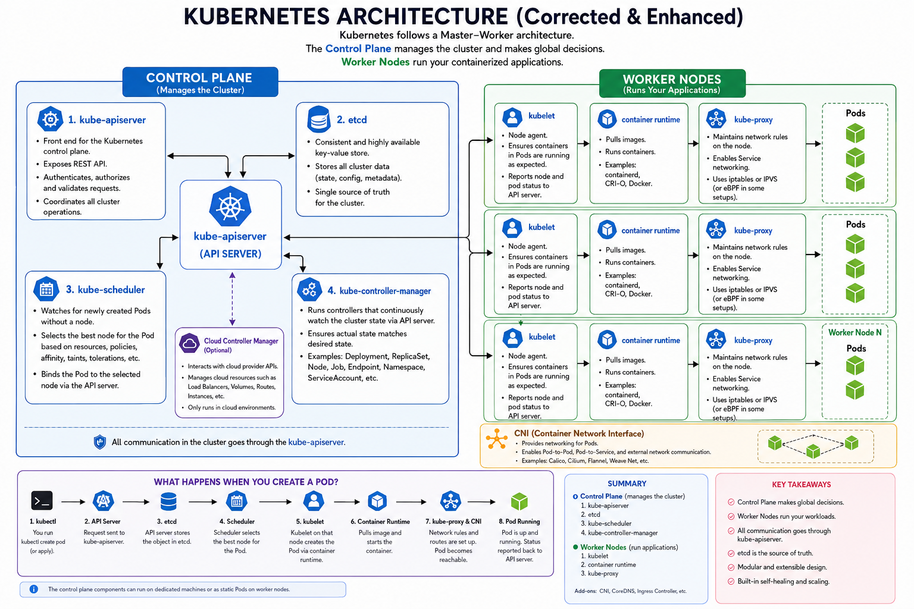

# Kubernetes Introduction

This folder contains the foundational concepts and architecture required before starting the hands-on Kubernetes labs in this repository.

## Contents

### 📐 Kubernetes Architecture



The architecture diagram provides a visual overview of:

- Kubernetes Control Plane
- Worker Nodes
- kube-apiserver
- etcd
- kube-scheduler
- kube-controller-manager
- cloud-controller-manager
- kubelet
- Container Runtime
- kube-proxy
- CNI
- Pods
- Communication between Kubernetes components

### 📚 Kubernetes Fundamentals

[Read the complete Kubernetes notes](./kubernetes-complete-notes.md)

The notes cover:

- What is Kubernetes?
- Why Kubernetes is needed
- Kubernetes architecture
- Control Plane components
- Worker Node components
- `kubectl`
- Container Runtime
- CNI and Kubernetes networking
- Kubernetes objects
- Pods
- ReplicaSets
- Deployments
- Services
- DaemonSets
- Jobs
- Namespaces
- Labels and Selectors
- ConfigMaps
- Secrets
- Volumes and Persistent Storage
- Health Probes
- Resource Requests and Limits
- Self-healing
- Scaling
- Rolling Updates
- Rollbacks
- Declarative configuration

## Learning Goal

The goal of this section is to understand **how Kubernetes works internally and how its major components interact** before moving into practical labs.

After completing this introduction, continue with the individual labs to practice Kubernetes concepts hands-on.

## Recommended Learning Flow

```text
Kubernetes Introduction
        ↓
Architecture
        ↓
Kubernetes Objects
        ↓
Pods
        ↓
Deployments
        ↓
Services
        ↓
Networking
        ↓
Storage
        ↓
Scaling
        ↓
Security
        ↓
Advanced Kubernetes